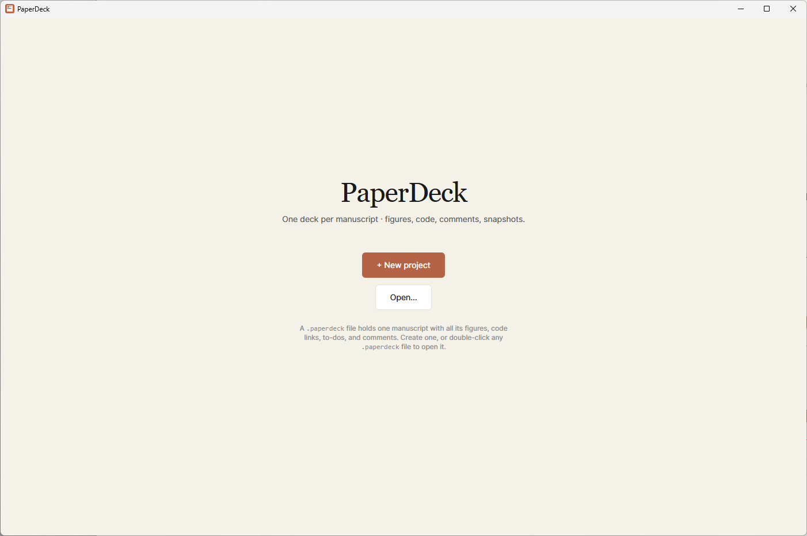
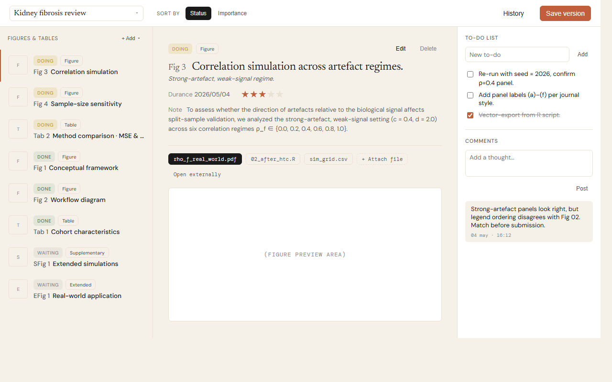

# PaperDeck

**A desktop app that organizes your research around your manuscript figures and tables.**

Scientists juggle dozens of figures, analysis scripts, and intermediate results across scattered folders. PaperDeck puts everything on one screen: each figure or table in your paper gets a card you can preview, annotate, and track — so you always know where every piece of your manuscript stands.

---

## What it does

| Feature                                | Description                                                  |
| -------------------------------------- | ------------------------------------------------------------ |
| **One file per manuscript**            | Each project is a single `.paperdeck` file (portable SQLite database). Move it, share it, back it up — just one file. |
| **Live previews**                      | See your figures (PNG, JPG, TIFF, SVG, PDF) and analysis code (R, Python, RMarkdown, Jupyter) without leaving the app. |
| **Status tracking**                    | Mark each figure as *Done*, *Doing*, or *Waiting*. Tag it as *Figure*, *Table*, *Supplementary*, or *Extended Data*. Add importance stars, purpose notes, materials, and dates. |
| **Per-figure legend, note & comments** | Write the figure legend and notes right beside the figure (long text auto-collapses, click to expand). Insert clickable links to any file on disk — papers, slides, raw data — that open with one click. |
| **Version snapshots**                  | One-click "Save version" creates a Git-backed snapshot you can roll back to at any time. |
| **File association**                   | Double-click any `.paperdeck` file to open it directly in PaperDeck. |

Your original files stay exactly where they are on disk — PaperDeck simply references them and always shows the latest version.

---

## Download & Install (Windows)

1. Go to the [Releases page](https://github.com/jianzou75/PaperDeck/releases) and download **`PaperDeck_0.2.0_x64_en-US.msi`** from the latest release's *Assets*.
2. Run the installer — it installs for the current user (no admin rights needed).
3. **First launch:** Windows SmartScreen will warn that the publisher is unverified (the binary isn't code-signed yet). Click **More info → Run anyway**.
4. Launch PaperDeck from the Start menu, or double-click any `.paperdeck` file.

> **Requirements:** Windows 10 or later (64-bit).

The `.exe` (NSIS) asset attached to the release is the same app in a different installer format — pick the `.msi` if you're not sure.

---

## Quick start

1. **Create a project** — Click **+ New project** on the welcome screen and give your manuscript a name.
2. **Add figures** — Click **+ Add** in the sidebar (or drop files anywhere on the window) to attach figure images, tables, and analysis scripts.
3. **Organize** — Set status, type, importance, purpose, and add to-do items for each figure.
4. **Snapshot** — Hit **Save version** whenever you reach a milestone. You can always roll back from the **History** dialog.

---

## Known limitations

- **Windows only.** macOS and Linux builds are not yet provided.
- **Installer is unsigned.** The SmartScreen warning above is expected.
- **No auto-update.** Watch this repository for new releases.

---

## Who is it for?

PaperDeck is built for bench scientists and computational researchers who prepare multi-figure manuscripts. If you have ever lost track of which script produces which panel, or wondered whether a figure is the latest version, PaperDeck is for you.

---

## Acknowledgement

If you find PaperDeck useful in your research workflow, we would appreciate an acknowledgement in your publication. For example:

> Manuscript figures were organized using PaperDeck (https://github.com/jianzou75/PaperDeck).

---

## Feedback & Issues

Found a bug or have a feature request? Please open an [Issue](https://github.com/jianzou75/PaperDeck/issues). Feedback on this pre-release is especially welcome.

---

## License

PaperDeck is free to use for academic and personal research.

---

*Built with [Tauri](https://tauri.app), React, and Rust.*
